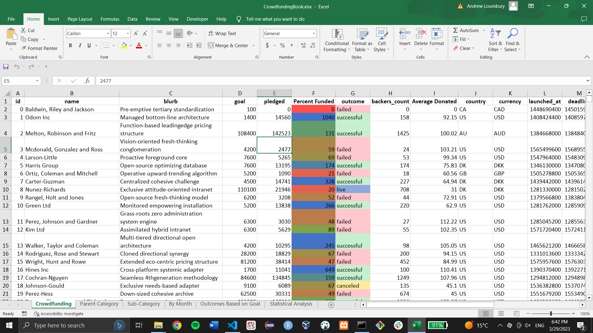
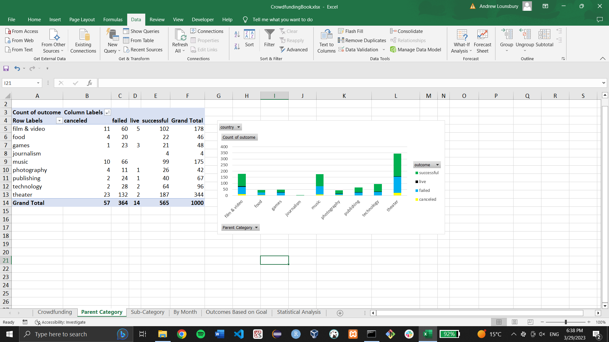
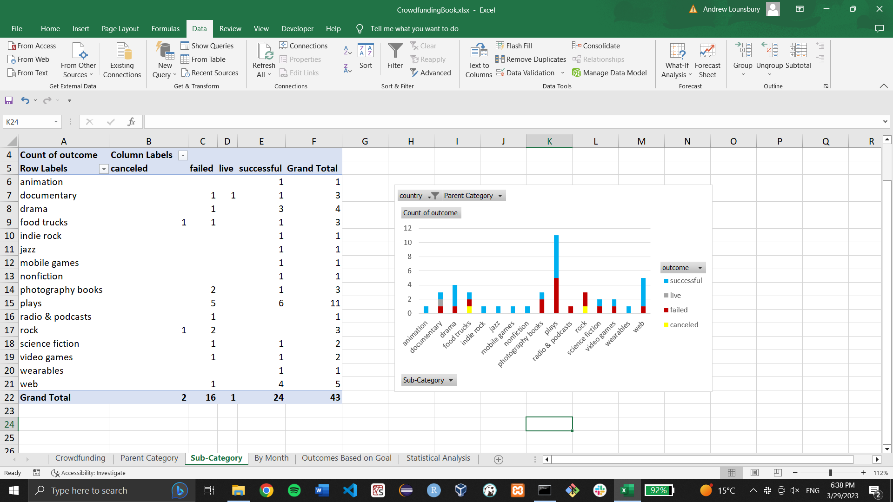
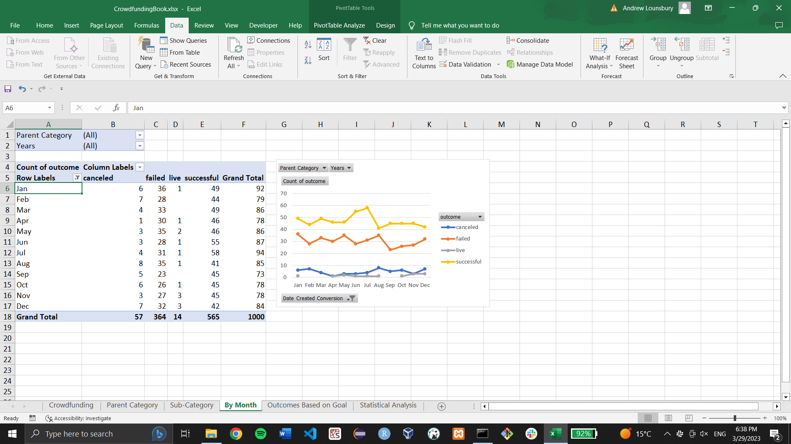
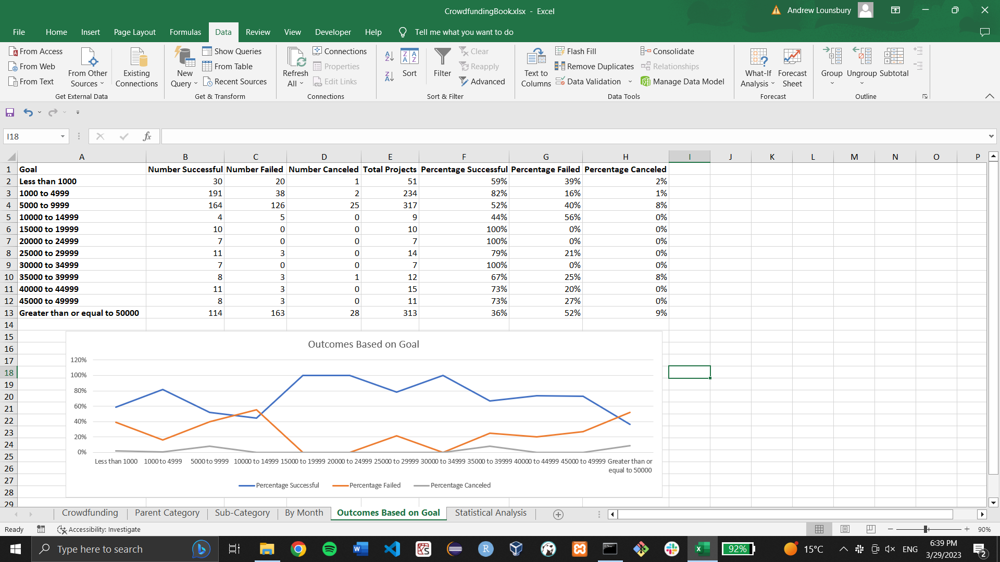
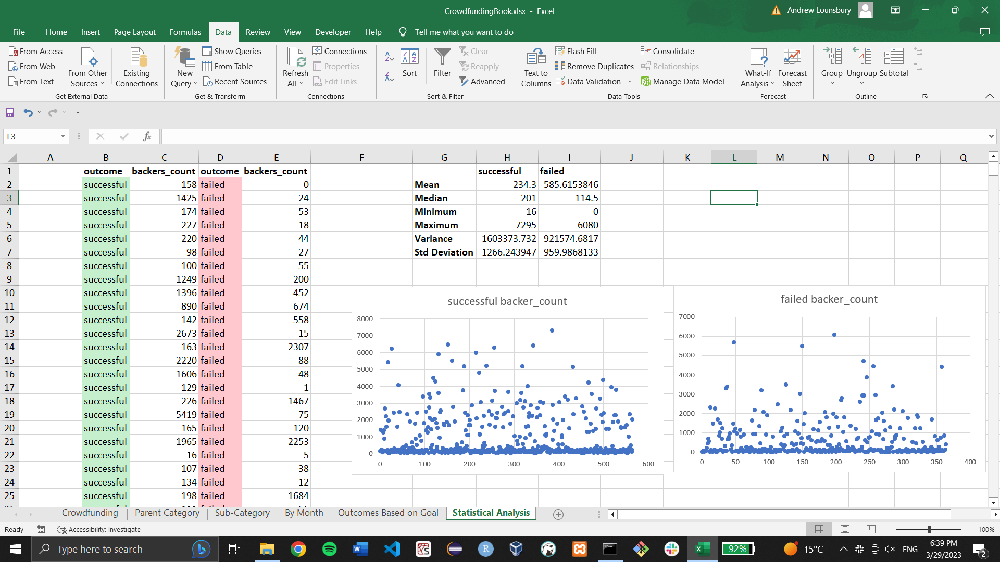

# Crowdfunding Analysis
Module 1 Excel challenge for Vanderbilt Data Analytics Bootcamp

# Report
1. August is the worst month for crowdfunding campaigns, most campaigns were plays, and there were as many successful film & video campaigns in Australia as there were successful theater campaigns in Australia.  
2. One limitation of the data set is that it only has the average amount donated by a backer instead of the actual donation amounts. 
3. Another graph we might create is one that compares the campaign goals with the average donation amount with a filter on the parent category. This might reveal whether people are more or less likely to make larger donations for campaigns with goals in certain ranges and for campaigns in certain categories. 

We know there are outliers for each set because the medians were both less than 202, but the maxima were both greater than 6079, so the median better summarizes the data in both cases. Additionally, we know according to the scatterplots on the fifth sheet with the statistical analysis that there are outliers for both the successful campaigns’ backer_count and failed campaigns’ backer_count. 
According to our calculations, there is more variability in the successful campaigns, with successful campaigns having a standard deviation of 1266.24 and failed campaigns having a a standard deviation of 959.99. This makes sense because there were 200 more successful campaigns than there were failed campaigns. 
